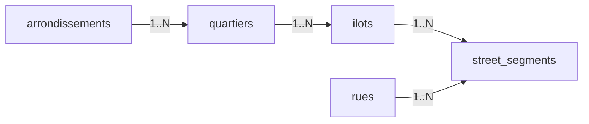

## Goal

Make `(streetName, houseNumber)` -> `(arrondissement, quartier, ilot)` a single indexed query, faithful to the source registers (one row per written range), and discard bobine/page as identity while keeping them as nullable provenance metadata.

## Final entity-relationship picture



A `street_segments` row says: "house numbers from N to M on this side (parity) of this street live in this îlot". The îlot transitively gives us quartier and arrondissement, so the segment is the only edge that needs to exist.

## Schema changes

All changes are in `apps/api/src/db/schemas/` plus the Drizzle Kit schema list and a generated migration.

### 1. Tighten `rues.normalized_name` to unique

In [apps/api/src/db/schemas/rues.ts](apps/api/src/db/schemas/rues.ts), replace the plain index with a unique index:

```ts
(table) => [
  uniqueIndex("rues_name_normalized_unique").on(table.normalizedName),
];
```

Streets that cross multiple arrondissements stay one row; the segments handle the per-arrondissement mapping.

### 2. New `street_segments` table

Create `apps/api/src/db/schemas/street_segments.ts`:

```ts
import {
  check,
  index,
  integer,
  sqliteTable,
  text,
} from "drizzle-orm/sqlite-core";
import { sql } from "drizzle-orm";
import { rues } from "./rues";
import { ilots } from "./ilots";

export const streetSegments = sqliteTable(
  "street_segments",
  {
    id: integer("id").primaryKey({ autoIncrement: true }),
    rueId: integer("rue_id")
      .references(() => rues.id)
      .notNull(),
    ilotId: integer("ilot_id")
      .references(() => ilots.id)
      .notNull(),
    parity: text("parity", { enum: ["odd", "even", "both"] }).notNull(),
    fromNumber: integer("from_number").notNull(),
    toNumber: integer("to_number").notNull(),
    fromSuffix: text("from_suffix"), // 'bis','ter', null
    toSuffix: text("to_suffix"),
    rawRange: text("raw_range"), // as written in the register
    sourceBobine: integer("source_bobine"),
    sourcePage: integer("source_page"),
    notes: text("notes"),
  },
  (table) => [
    index("street_segments_rue_range_idx").on(
      table.rueId,
      table.fromNumber,
      table.toNumber
    ),
    index("street_segments_ilot_idx").on(table.ilotId),
    check(
      "street_segments_range_ok",
      sql`${table.fromNumber} <= ${table.toNumber}`
    ),
  ]
);
```

Notes on each field:

- `parity` constrained to `'odd' | 'even' | 'both'` — Paris house numbers run odd on one side, even on the other; some short segments cover both.
- `fromNumber == toNumber` for single-house segments (no special case needed).
- `from_suffix` / `to_suffix` carry "bis", "ter" without forcing them into the integer.
- `raw_range`, `source_bobine`, `source_page`, `notes` are pure metadata — not part of any key, FK, or query predicate.
- `CHECK (from_number <= to_number)` keeps the data sane; trivial for SQLite/D1.

### 3. Wire it into the schema barrel and Drizzle Kit

- Add `street_segments` to [apps/api/src/db/schemas/index.ts](apps/api/src/db/schemas/index.ts) and to the explicit re-exports in `apps/api/src/db/schema.ts` (per the AGENTS guide, `export *` barrels aren't enough for `drizzle-kit generate`).
- The `schema` entry in [apps/api/drizzle.config.ts](apps/api/drizzle.config.ts) already points at `./src/db/schema.ts`, so just adding the table re-export there is enough.

### 4. Generate the migration

From `apps/api/`:

- `npm run db:generate` produces a new SQL file under `apps/api/drizzle/` (likely `0004_*.sql`) with:
  - `DROP INDEX rues_name_normalized_idx;`
  - `CREATE UNIQUE INDEX rues_name_normalized_unique ON rues (name_normalized);`
  - `CREATE TABLE street_segments (...);`
  - the two indexes and the check constraint.
- `npm run db:migrate:local` applies it locally; remote follows once `database_id` is set.

Commit the generated file alongside the schema edits.

## How the lookup will work (reference for the next plan)

This is not part of this plan's edits, just confirming the model supports the target query in one statement:

```sql
SELECT a.number AS arr,
       q.name   AS quartier,
       i.number AS ilot
FROM street_segments s
JOIN rues r            ON r.id = s.rue_id
JOIN ilots i           ON i.id = s.ilot_id
JOIN quartiers q       ON q.id = i.quartier_id
JOIN arrondissements a ON a.id = q.arrondissement_id
WHERE r.normalized_name = :street
  AND :n BETWEEN s.from_number AND s.to_number
  AND (s.parity = 'both'
       OR s.parity = CASE WHEN (:n % 2) = 0 THEN 'even' ELSE 'odd' END);
```

Hits the `street_segments_rue_range_idx` index, then four PK joins. Sub-millisecond at Paris scale.

## Explicitly out of scope (next plans)

- API routes (Hono handlers for search, list quartiers, list îlots).
- Search query parser ("12 rue Vaugirard" / "rue Vaugirard 14bis" / number ranges).
- React UI.
- Extraction pipeline that turns scanned bobine pages into `street_segments` rows.
- Aliases / fuzzy matching (`street_aliases` table) — defer until real data shows it's needed.
- Suffix-aware comparison (`12bis` vs `12`) — likely fine to ignore until extraction reveals how often it matters.
