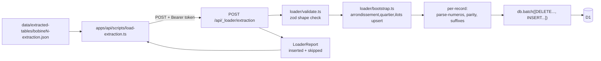

# Extraction Loader Implementation Plan

This plan implements the loader designed in the grill session. Decisions are already locked in [docs/adr/0004-loader-whole-bobine-wipe-on-reload.md](docs/adr/0004-loader-whole-bobine-wipe-on-reload.md), [docs/adr/0005-loader-runs-in-the-worker-cli-is-thin-client.md](docs/adr/0005-loader-runs-in-the-worker-cli-is-thin-client.md), [docs/adr/0006-loader-skip-and-log-per-row.md](docs/adr/0006-loader-skip-and-log-per-row.md), and the field mapping table in [docs/EXTRACTION.md](docs/EXTRACTION.md#loader-field-mapping). No further design questions to answer; this is execution.

## Architecture



## Step 1: Schema migration for cascade deletes

Change the FK definitions on `street_segments.source_entry_id` and `segment_ilots.segment_id` to `ON DELETE CASCADE`. This is what makes the whole-bobine wipe a one-statement `DELETE FROM source_entries WHERE bobine = ?`.

- Edit [apps/api/src/db/schemas/street_segments.ts](apps/api/src/db/schemas/street_segments.ts): change `sourceEntryId` from `.references(() => sourceEntries.id)` to `.references(() => sourceEntries.id, { onDelete: "cascade" })`.
- Edit [apps/api/src/db/schemas/segment_ilots.ts](apps/api/src/db/schemas/segment_ilots.ts): change `segmentId` from `.references(() => streetSegments.id)` to `.references(() => streetSegments.id, { onDelete: "cascade" })`.
- Run `npm run db:generate -w api`. Drizzle Kit will emit `apps/api/drizzle/0013_<slug>.sql` doing the SQLite table-rebuild dance (matches the style of `0010_…`).
- Hand-edit the generated SQL to re-create the `segment_ilots_quartier_consistency` trigger after the `segment_ilots` rebuild (Kit doesn't generate triggers; the trigger is defined in `0010_…sql`).
- Rename the migration file to `0013_loader_cascade_deletes.sql` and update the corresponding `tag` in [apps/api/drizzle/meta/\_journal.json](apps/api/drizzle/meta/_journal.json) per the repo convention in [docs/AGENTS.md](docs/AGENTS.md).
- Apply locally: `npm run db:migrate:local -w api`.

## Step 2: Loader module — pure validation and parsing

Create [apps/api/src/loader/](apps/api/src/loader/) and seed three pure files.

**`apps/api/src/loader/types.ts`** — shared types:

```typescript
export const SKIP_REASON = {
  OPEN_ENDED_RANGE: "OPEN_ENDED_RANGE",
  INVERTED_RANGE: "INVERTED_RANGE",
  RANGE_ENDPOINT_PARITY_MISMATCH: "RANGE_ENDPOINT_PARITY_MISMATCH",
  UNKNOWN_VOIE_TYPE: "UNKNOWN_VOIE_TYPE",
  UNKNOWN_SUFFIX: "UNKNOWN_SUFFIX",
  CROSS_QUARTIER_ILOT: "CROSS_QUARTIER_ILOT",
  EMPTY_OR_UNPARSEABLE_NUMEROS_RAW: "EMPTY_OR_UNPARSEABLE_NUMEROS_RAW",
  MISSING_ILOT_NUMBERS: "MISSING_ILOT_NUMBERS",
} as const;
export type SkipReason = keyof typeof SKIP_REASON;

export type LoaderReport = {
  bobine: number;
  inserted: {
    arrondissements: number;
    quartiers: number;
    ilots: number;
    rues: number;
    source_entries: number;
    street_segments: number;
    segment_ilots: number;
  };
  skipped: Array<{
    reading_order_index: number;
    reason: SkipReason;
    detail: string;
  }>;
};
```

**`apps/api/src/loader/validate.ts`** — zod schema mirroring [docs/LLM_EXTRACTION_INTERCHANGE.md](docs/LLM_EXTRACTION_INTERCHANGE.md). One `batchSchema` covering `document_scope` (required: `quartier`, `arrondissement`, `bobine`) and `logical_records[]` (required: `reading_order_index`, `pdf_page`, `ilot_numbers`, `raw_text`, `rue: { type, libelle, inferred? }`, `numeros_raw`; optional: `page`, `sequence`, `scan_note`, `low_confidence`). Failure here returns a 400 with the zod issues — that's the structural-error boundary from ADR-0006.

**`apps/api/src/loader/parse-numeros.ts`** — pure `parseNumerosRaw(text: string): { tokens: ParsedToken[]; rejects: Array<{ reason: SkipReason; detail: string }> }`. Algorithm:

- Tokenize on `/[,;\/]/`, trim each.
- Per-token: match `/^(\d+)\s*(bis|ter|quater|quinquies|sexies|septies)?\s*(?:->\s*(\d+)\s*(bis|ter|quater|quinquies|sexies|septies)?)?\s*$/i`.
- A token starting with `->` (no left endpoint) or ending with `+` → `OPEN_ENDED_RANGE`. A token matching the regex with the range half present and `to < from` (lex on `(n, suffix_rank)`) → `INVERTED_RANGE`. A range with mismatched-parity endpoints → `RANGE_ENDPOINT_PARITY_MISMATCH`. Suffix not in `SUFFIX_RANK` → `UNKNOWN_SUFFIX`. Empty text or zero tokens → `EMPTY_OR_UNPARSEABLE_NUMEROS_RAW`.
- Suffix rank lookup via existing [apps/api/src/lib/suffix.ts](apps/api/src/lib/suffix.ts).

`ParsedToken` shape:

```typescript
type ParsedToken =
  | { kind: "singleton"; n: number; suffix: string | null; rank: number }
  | {
      kind: "range";
      from: { n: number; suffix: string | null; rank: number };
      to: { n: number; suffix: string | null; rank: number };
    };
```

## Step 3: Loader module — geography bootstrap

**`apps/api/src/loader/bootstrap.ts`** — `bootstrapGeography(db, scope, allIlotNumbers): Promise<{ arrondissementId, quartierId, ilotIdByNumber: Map<number, number>, inserted: { arrondissements, quartiers, ilots }, crossQuartierIlots: Set<number> }>`.

- Static map: `const ARR_NAME: Record<number, string> = { 1: "1er", 2: "2e", ..., 20: "20e" }` (per [CONTEXT.md](CONTEXT.md) § Arrondissement).
- `INSERT OR IGNORE` arrondissement by `number`, then `SELECT` the id.
- Normalize the quartier name via [apps/api/src/lib/normalize.ts](apps/api/src/lib/normalize.ts); `INSERT OR IGNORE` quartier on `(arrondissement_id, name_normalized)`; `SELECT` id.
- For each unique ilot number across all records:
  - `INSERT OR IGNORE` with `(quartier_id, number)`; if the resulting `SELECT` shows the existing row's `quartier_id` differs from the batch's quartier → add to `crossQuartierIlots` (caller skips every record citing that ilot with `CROSS_QUARTIER_ILOT`).
- Drizzle's D1 driver returns `meta.changes` on each call so the `inserted.*` counts reflect actually-new rows.

## Step 4: Loader module — orchestration entry point

**`apps/api/src/loader/index.ts`** — `loadBatch(db: Database, payload: unknown): Promise<{ status: 200; body: LoaderReport } | { status: 400; body: { error: string; issues: unknown } }>`.

Flow:

1. `validate.ts` → 400 on shape failure.
2. `db.batch([sql.raw('DELETE FROM source_entries WHERE bobine = ?').bind(N)])` — cascade does the rest. (Wrapped via Drizzle's `db.delete()` works too.)
3. `bootstrapGeography(...)`.
4. For each `logical_records[]` item:
   - If any `ilot_numbers[i]` is in `crossQuartierIlots` → push `{ reading_order_index, reason: "CROSS_QUARTIER_ILOT", detail }`, continue.
   - Resolve `voie_types.code` (lowercase `record.rue.type`). Miss → `UNKNOWN_VOIE_TYPE`, continue.
   - `INSERT OR IGNORE` into `rues` with `(type_id, libelle_normalized, libelle)`; resolve `rue_id`.
   - `parseNumerosRaw(record.numeros_raw)`. If `tokens.length === 0` → emit one skip per `rejects[]` entry (deduped) **and** continue (no segments emitted). If `rejects` non-empty but `tokens` also non-empty: emit skips for the rejected tokens and still load the valid ones.
   - Stage one `source_entries` insert and one `street_segments` insert per token. Set `quality_flags = record.low_confidence ? SEGMENT_QUALITY.LOW_CONFIDENCE_EXTRACTION : 0` and `type_inferred = record.rue.inferred === true` on each segment. Stage `segment_ilots` rows for `(segment_id, ilot_id)` × each ilot in `ilot_numbers`.
5. Chunk the staged inserts into `db.batch([...])` calls of ≤500 statements each to stay under D1's per-batch limit.
6. Return the populated `LoaderReport`.

Two implementation notes:

- `street_segments` and `segment_ilots` require the `source_entries.id` of the freshly-inserted parent. D1 returns `meta.last_row_id` on each statement, so the batch must execute `source_entries` insert first, capture its id, then chain. Drizzle's `.returning({ id })` works for this.
- The geography `INSERT OR IGNORE`s run as a separate small batch **before** the per-record batch starts; otherwise the per-record statements would reference unresolved FKs.

## Step 5: Worker route + token

- Edit [apps/api/src/index.ts](apps/api/src/index.ts) to mount `POST /api/_loader/extraction`:

```typescript
app.post("/api/_loader/extraction", async (c) => {
  const auth = c.req.header("Authorization") ?? "";
  if (auth !== `Bearer ${c.env.LOADER_TOKEN}`)
    return c.json({ error: "unauthorized" }, 401);
  const result = await loadBatch(c.get("db"), await c.req.json());
  return c.json(result.body, result.status);
});
```

- Edit [apps/api/wrangler.jsonc](apps/api/wrangler.jsonc) to declare `LOADER_TOKEN` under `vars` (placeholder) — secret value goes through `wrangler secret put LOADER_TOKEN` for production and through [apps/api/.dev.vars](apps/api/.dev.vars) for local.
- Run `npm run types:api` from the root to refresh [apps/api/worker-configuration.d.ts](apps/api/worker-configuration.d.ts) so `c.env.LOADER_TOKEN` is typed.

## Step 6: Node CLI thin client

**`apps/api/scripts/load-extraction.ts`** — reads a file, POSTs to the Worker, prints the report, exits non-zero on 4xx/5xx.

- Flags: `--file <path>` (required), `--api-url <url>` (default `http://127.0.0.1:8787`), `--token <secret>` (or `$LOADER_TOKEN` from env).
- Uses `node:fs/promises`, native `fetch`, no extra deps. Node 25 is in `devDependencies`.
- Add `tsx` as a `devDependency` of `apps/api` and a script `"loader:run": "tsx scripts/load-extraction.ts"` in [apps/api/package.json](apps/api/package.json) so invocation is `npm run loader:run -w api -- --file ../../data/extracted-tables/bobine8-extraction.json --token "$LOADER_TOKEN"`.
- Output: grouped breakdown of `skipped[]` by `reason`, plus the `inserted` counts.

## Step 7: Run end-to-end against local D1

- In one shell: `npm run dev:api` (starts `wrangler dev`).
- In another, set `LOADER_TOKEN` in `apps/api/.dev.vars`, then:
  - `npm run loader:run -w api -- --file ../../data/extracted-tables/bobine8-extraction.json`
  - `npm run loader:run -w api -- --file ../../data/extracted-tables/bobine43-extraction.json`
- Verify with `npm run db:studio -w api` (after setting `DRIZZLE_STUDIO_DATABASE_URL` per [apps/api/drizzle.config.ts](apps/api/drizzle.config.ts)) that the expected counts land: rough order-of-magnitude is one `source_entries` row per `logical_records[]` element (~250 for bobine 8, ~150 for bobine 43), plus segments per parsed token, plus `segment_ilots` per `(segment × ilot)` pair.
- Re-run the same file to confirm the wipe behaves: counts should not double, and previously-orphaned `rues`/`ilots` from a hypothetical earlier load remain in place as benign reference data (per ADR-0004).

## Files touched (summary)

- New: `apps/api/drizzle/0013_loader_cascade_deletes.sql`, `apps/api/src/loader/{types,validate,parse-numeros,bootstrap,index}.ts`, `apps/api/scripts/load-extraction.ts`
- Edited: `apps/api/src/db/schemas/{street_segments,segment_ilots}.ts`, `apps/api/src/index.ts`, `apps/api/wrangler.jsonc`, `apps/api/.dev.vars`, `apps/api/package.json`, `apps/api/drizzle/meta/_journal.json`, `apps/api/drizzle/meta/0013_snapshot.json` (generated), `apps/api/worker-configuration.d.ts` (regenerated)
- Untouched (intentional): the existing migrations, the `lib/` utilities, [docs/AGENTS.md](docs/AGENTS.md) (no workflow change)

## Out of scope

- No unit tests for `parse-numeros.ts` in this pass (the corpus is the integration test; per-token unit tests can land in a follow-up if `wrangler tail` surfaces unexpected parse rejects).
- No production deploy of the route — `database_id` in `wrangler.jsonc` is still `REPLACE_ME_AFTER_WRANGLER_D1_CREATE`. Local D1 is the v0 target.
- No suggest / lookup endpoints — separate grill, separate plan.
- No resolution of the ADR-0003 conflict-semantics ambiguity surfaced during Q6. Filed for the lookup-endpoint grill.
