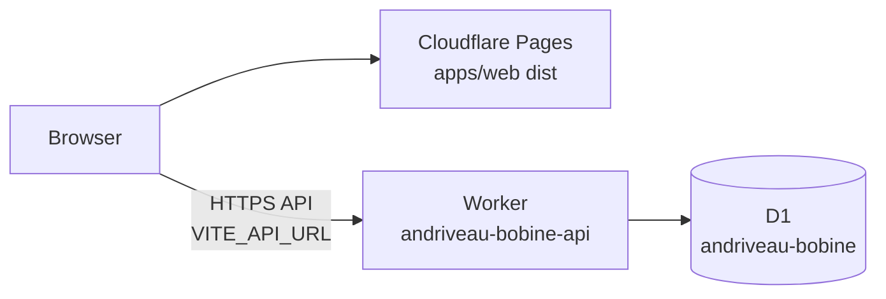

# Deploy v1 — Cloudflare Worker, D1, and Pages

Step-by-step guide to ship the **andriveau-bobine** v1 stack for client testing. Everything below assumes you work from the **repository root** unless a path says otherwise.

**Current repo state (check before you start):**

- `apps/api/wrangler.jsonc` — Worker name `andriveau-bobine-api`, D1 `database_id` is still `REPLACE_ME_AFTER_WRANGLER_D1_CREATE`.
- `apps/api` — never deployed; local D1 only (`wrangler dev` + `db:migrate:local`).
- `apps/web` — uses relative `/api/...` URLs (Vite dev proxy only); production needs an explicit API base URL.
- `apps/api/src/index.ts` — CORS allows `localhost:5173` / `127.0.0.1:5173` only.
- Register data — two extraction JSON files under `data/extracted-tables/` (bobine 8 and 43); load via the **loader HTTP route** (ADR-0005), not raw SQL dumps in migrations.

**Architecture after deploy:**



---

## 0. Prerequisites

| Requirement | Notes |
|-------------|--------|
| Cloudflare account | Workers + D1 + Pages on the same account is simplest. |
| Wrangler auth | `npx wrangler login` then `npx wrangler whoami`. |
| Node + npm | From repo root: `npm install`. |
| Local data loaded (recommended) | You already use `npm run dev:api` + `loader:run` locally; same JSON files seed production. |
| Git remote | Pages Git integration needs the repo on GitHub/GitLab (or use CLI deploy). |

All `wrangler` / `npm run … -w api` examples assume **`cd apps/api`** or `-w api` from the root.

---

## 1. Create remote D1 and wire `wrangler.jsonc`

### 1.1 Create the database

```bash
cd apps/api
npx wrangler d1 create andriveau-bobine
```

Copy the **`database_id`** UUID from the command output.

### 1.2 Update config

Edit `apps/api/wrangler.jsonc`:

```jsonc
"database_id": "<paste-uuid-here>",
```

Commit this change (the id is not secret; it identifies your D1 instance).

### 1.3 Regenerate Worker types (optional but good practice)

```bash
npm run types:api
# or: cd apps/api && npm run types
```

### 1.4 Apply migrations to **remote** D1

Creates empty tables + reference seeds from SQL migrations (e.g. `voie_types`), but **not** bobine register rows.

```bash
cd apps/api
npm run db:migrate:remote
```

Confirm pending migrations applied:

```bash
npx wrangler d1 migrations list andriveau-bobine --remote
```

**Sanity check:**

```bash
npx wrangler d1 execute andriveau-bobine --remote --command "SELECT name FROM sqlite_master WHERE type='table' ORDER BY 1;"
```

---

## 2. Deploy the API Worker

### 2.1 Dry-run (catch config errors early)

```bash
cd apps/api
npm run check
npm run typecheck
```

### 2.2 Set production `LOADER_TOKEN` (secret)

Do **not** rely on the placeholder in `wrangler.jsonc` `vars.LOADER_TOKEN` in production.

Generate a long random token (password manager or `openssl rand -hex 32`). Store it locally (password manager); you will need it for seeding.

```bash
cd apps/api
npx wrangler secret put LOADER_TOKEN
# paste token when prompted
```

For local dev, keep using `apps/api/.dev.vars` (gitignored):

```
LOADER_TOKEN=<same-or-different-dev-token>
```

### 2.3 Deploy

```bash
cd apps/api
npm run deploy
```

Note the deployed URL, e.g. `https://andriveau-bobine-api.<your-subdomain>.workers.dev`.

### 2.4 Verify Worker + D1 binding

```bash
curl -sS "https://andriveau-bobine-api.<subdomain>.workers.dev/api/health"
curl -sS "https://andriveau-bobine-api.<subdomain>.workers.dev/api/db/health"
```

Both should return JSON with `"ok": true` (db health also `"db": true`).

---

## 3. Seed remote D1 (register data)

### Can you copy local dev D1 instead?

**Yes, as a shortcut** — but this repo’s **recommended** path is the **loader** (same code path as dev, ADR-0005). Copying SQLite is fine for a one-off if local and remote schemas match.

| Approach | When to use | Pros | Cons |
|----------|-------------|------|------|
| **A. Loader (recommended)** | Normal v1 deploy | Reproducible from `data/extracted-tables/*.json`; validates on D1 engine | Needs deployed Worker + secret; destructive per bobine reload |
| **B. SQL export/import** | Emergency clone of local DB | Fast if local already correct | Easy to drift schema; import not atomic; BLOB caveats per Cloudflare docs |

### 3A. Seed via loader (recommended)

From **repository root**, with Worker **deployed** and `LOADER_TOKEN` set:

```bash
export LOADER_TOKEN='<your-production-token>'

npm run loader:run -w api -- \
  --file ../../data/extracted-tables/bobine8-extraction.json \
  --api-url https://andriveau-bobine-api.<subdomain>.workers.dev \
  --token "$LOADER_TOKEN"

npm run loader:run -w api -- \
  --file ../../data/extracted-tables/bobine43-extraction.json \
  --api-url https://andriveau-bobine-api.<subdomain>.workers.dev \
  --token "$LOADER_TOKEN"
```

Each run **replaces** all data for that bobine (`DELETE` cascade per ADR-0004). Check CLI output for `Inserted` counts and `Skipped rows`.

**Smoke-test API reads:**

```bash
curl -sS "https://andriveau-bobine-api.<subdomain>.workers.dev/api/rues/suggest?q=notre"
```

### 3B. Copy local D1 via SQL (optional)

Only if remote migrations match local and you want a byte-for-byte copy.

1. Export **local** (schema + data):

   ```bash
   cd apps/api
   npx wrangler d1 export andriveau-bobine --local --output=./local-full.sql
   ```

2. Apply migrations on **remote** first (§1.4) — schema must already exist.

3. Export **data only** to avoid clashing with migration schema:

   ```bash
   npx wrangler d1 export andriveau-bobine --local --no-schema --output=./local-data.sql
   ```

4. Import to remote:

   ```bash
   npx wrangler d1 execute andriveau-bobine --remote --file=./local-data.sql
   ```

   Large imports may need splitting; import is **not** one atomic transaction.

**Local SQLite path (Drizzle Studio):** see `apps/api/drizzle.config.ts` — use the `*.sqlite` under `.wrangler/state/v3/d1/miniflare-D1DatabaseObject/`, not an empty sibling file.

---

## 4. Production wiring (required code/config changes)

Dev uses Vite’s `/api` → `127.0.0.1:8787` proxy. **Pages has no such proxy** unless you add Pages Functions or a reverse proxy. For v1, point the SPA at the Worker URL.

### 4.1 API base URL in the web app

1. Add a small helper, e.g. `apps/web/src/lib/apiBase.ts`:

   ```ts
   /** Trailing slash stripped; empty in dev → relative `/api` (Vite proxy). */
   export function apiUrl(path: string): string {
     const base = (import.meta.env.VITE_API_URL as string | undefined)?.replace(/\/$/, "") ?? "";
     return `${base}${path}`;
   }
   ```

2. In `apps/web/src/rue-suggest/api.ts` and `apps/web/src/lookup/api.ts`, replace `` `/api/...` `` with `apiUrl("/api/...")`.

3. Document env in `apps/web/.env.example` (commit example only):

   ```
   # Production Pages: full Worker origin, no trailing slash
   # VITE_API_URL=https://andriveau-bobine-api.<subdomain>.workers.dev
   ```

### 4.2 CORS on the Worker

Update `apps/api/src/index.ts` to allow your **Pages origin(s)**:

```ts
cors({
  origin: [
    "http://localhost:5173",
    "http://127.0.0.1:5173",
    "https://andriveau-bobine-web.pages.dev",           // default Pages subdomain
    "https://<your-production-pages-hostname>",       // custom domain if any
  ],
  // ...
});
```

Redeploy API after this change: `npm run deploy -w api`.

Preview deployments use URLs like `https://<hash>.andriveau-bobine-web.pages.dev` — add those origins too if clients test PR previews.

### 4.3 (Alternative) Same-origin `/api` on Pages

Possible later: Pages **Functions** or `_redirects` / route rules to proxy `/api/*` to the Worker. Not required for v1 if you use `VITE_API_URL`.

---

## 5. Deploy the frontend (Cloudflare Pages)

### 5.1 Build locally once

```bash
# from repo root
npm run build -w web
```

Output: `apps/web/dist/`.

Preview:

```bash
npm run preview -w web
```

### 5.2 Create Pages project

**Dashboard:** Workers & Pages → Create → Pages → Connect to Git.

| Setting | Value |
|---------|--------|
| Production branch | `main` (or your release branch) |
| Root directory | `/` (repository root) |
| Build command | `npm ci && npm run build -w web` |
| Build output directory | `apps/web/dist` |
| Node.js version | **20** or **22** |

**Environment variables (Production + Preview):**

| Name | Value |
|------|--------|
| `VITE_API_URL` | `https://andriveau-bobine-api.<subdomain>.workers.dev` (no trailing slash) |

Trigger a deploy after §4 code is on the connected branch.

### 5.3 CLI deploy (without Git integration)

```bash
npm run build -w web
cd apps/web
npx wrangler pages deploy dist --project-name=andriveau-bobine-web
```

Set `VITE_API_URL` in the Pages dashboard for the project (CLI deploy still reads dashboard env at build time if you use Git; for pure CLI, pass build env: `VITE_API_URL=... npm run build -w web`).

### 5.4 Custom domain (optional)

Pages → your project → Custom domains → add hostname (e.g. `bobine.example.com`). Then add that exact `https://` origin to Worker CORS and rebuild/redeploy the web app if the hostname is baked into any config (CORS only needs the API change).

---

## 6. End-to-end verification checklist

Use this after API deploy, seed, web deploy, and CORS/`VITE_API_URL` updates.

- [ ] `GET /api/health` and `GET /api/db/health` on the Worker URL succeed.
- [ ] `GET /api/rues/suggest?q=…` returns results for a street you know exists.
- [ ] Open the Pages URL in a browser; rue typeahead returns suggestions.
- [ ] Submit a full address lookup; results / conflit / no-match behave as in local dev.
- [ ] Browser devtools **Network**: API requests go to `VITE_API_URL`, not `pages.dev/api` (404).
- [ ] No CORS errors in the console (if you see them, fix §4.2 origins and redeploy API).
- [ ] Loader route **not** used from the public UI; token only on your machine for admin reloads.

---

## 7. Operational notes

### Re-load extraction JSON after fixes

Same as §3A: `loader:run` with `--api-url` pointing at production. Remember each bobine load **wipes** that bobine’s rows first.

### Logs

```bash
cd apps/api && npx wrangler tail
npx wrangler pages deployment tail --project-name=andriveau-bobine-web
```

### Backups (remote D1)

```bash
cd apps/api
npx wrangler d1 export andriveau-bobine --remote --output=./backup-$(date +%Y%m%d).sql
```

Point-in-time: [D1 Time Travel](https://developers.cloudflare.com/d1/reference/time-travel/) (retention depends on plan).

### Security for v1 testing

- Treat `LOADER_TOKEN` like a production secret; rotate if leaked.
- Do not commit `.dev.vars` or tokens in `wrangler.jsonc` `vars` for real deploys.
- The loader path `POST /api/_loader/extraction` is intentionally powerful; keep it token-gated only (already implemented in `loaderAuth`).

### Staging (optional next step)

Add Wrangler [environments](https://developers.cloudflare.com/workers/wrangler/environments/) (`env.staging` in `wrangler.jsonc`) with a separate D1 database or binding, a staging Worker, and a Pages preview branch — not required for the first client test.

---

## 8. Suggested order of operations (summary)

1. `wrangler login` / `whoami`
2. `wrangler d1 create` → paste `database_id` in `wrangler.jsonc`
3. `npm run db:migrate:remote -w api`
4. `wrangler secret put LOADER_TOKEN`
5. `npm run deploy -w api` → note Worker URL
6. `loader:run` for bobine 8 and 43 against deployed URL
7. Implement `VITE_API_URL` + CORS origins → redeploy API + Pages
8. Create Pages project, set `VITE_API_URL`, deploy
9. Run §6 checklist with the client

---

## References

- Repo: `AGENTS.md` (commands), `docs/adr/0005-loader-runs-in-the-worker-cli-is-thin-client.md`, `docs/EXTRACTION.md`
- Cloudflare: [Workers](https://developers.cloudflare.com/workers/), [D1](https://developers.cloudflare.com/d1/), [Pages](https://developers.cloudflare.com/pages/), [Wrangler](https://developers.cloudflare.com/workers/wrangler/)
