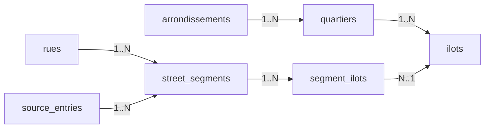

# Domain Data Model

This document describes the core domain model for address-based lookup in this project.
It focuses on entities, relationships, hierarchy, and the read pattern we optimize for.

## Goal And Optimization Target

Primary read pattern:

`(streetName, houseNumberWithOptionalSuffix) -> (arrondissement, quartier, ilot[])`

Key design choice:

- model source notations faithfully enough for auditability
- keep lookup fast with indexed range predicates
- keep provenance normalized and traceable

## Domain Hierarchy

Administrative hierarchy:

- `arrondissement` -> `quartier` -> `ilot`

Address mapping hierarchy:

- `rue` + `(parity, house-range)` -> `street_segment`
- `street_segment` -> one or more `ilot` via `segment_ilots`

Provenance hierarchy:

- one `source_entries` row represents one source notation line
- one source entry can produce many `street_segments`

## Entity Relationship Graph



## Entities

## `arrondissements`

Role:

- top-level administrative partition

Core fields:

- `id`
- `number` (unique)
- `name`

## `quartiers`

Role:

- subdivision of an arrondissement

Core fields:

- `id`
- `arrondissement_id` (FK -> `arrondissements.id`)
- `name`
- `name_normalized`

Constraint:

- unique on `(arrondissement_id, name_normalized)`

## `ilots`

Role:

- numbered block inside a quartier

Core fields:

- `id`
- `quartier_id` (FK -> `quartiers.id`)
- `number`

Constraint:

- unique on `(quartier_id, number)`

## `rues`

Role:

- canonical voie entity (any type: `Rue`, `Avenue`, `Boulevard`, ...)

Core fields:

- `id`
- `type` — canonical voie type (`Rue`, `Avenue`, `Boulevard`, `Place`, `Quai`, `Cours`, `Allée`, `Impasse`, `Passage`, `Square`, `Villa`, `Cité`, `Galerie`, `Pont`, `Esplanade`)
- `libelle` — canonical libellé (e.g. `de Vaugirard`, `du Cherche-Midi`)
- `libelle_normalized` — match form of the libellé (see Normalized form below)

Constraints and indexes:

- unique on `(type, libelle_normalized)`
- non-unique index on `libelle_normalized` for libellé-only autocomplete

Display name:

- not stored; derived as `${type} ${libelle}` at the API serialization layer

See `docs/adr/0001-rue-as-type-libelle.md` for the rationale of the split.

## `source_entries`

Role:

- one normalized provenance row for one source notation line

Core fields:

- `id`
- `bobine`
- `page`
- `raw_text`
- `sequence` (optional ordering on a page)
- `notes` (optional provenance notes)

Why this table exists:

- avoids provenance duplication across many segments
- allows easy QA trace-back from lookup result to source notation

## `street_segments`

Role:

- normalized address segment on a street side (`odd`/`even`) over an ordered range

Core fields:

- `id`
- `source_entry_id` (FK -> `source_entries.id`)
- `rue_id` (FK -> `rues.id`)
- `parity` (`odd` or `even`)
- `from_number`, `from_suffix_rank`
- `to_number`, `to_suffix_rank`
- `from_suffix`, `to_suffix` (display/source fidelity)
- `notes` (segment-level note)

Range semantics:

- singletons are represented by equal endpoints
- order uses `(number, suffix_rank)` on each side

Constraint:

- `from < to OR (from = to AND from_suffix_rank <= to_suffix_rank)`

## `segment_ilots`

Role:

- junction table for many-to-many between segments and ilots

Core fields:

- `segment_id` (FK -> `street_segments.id`)
- `ilot_id` (FK -> `ilots.id`)

Constraint:

- composite primary key `(segment_id, ilot_id)`

Why this table exists:

- one source segment can legitimately map to 2-3 ilots
- avoids duplicating segment rows per ilot

## Normalized form

`libelle_normalized` and `quartiers.name_normalized` use the same Aggressive transform:

- lowercase
- strip accents (NFD, drop combining marks)
- replace `'` and `-` with space
- collapse whitespace

Examples:

- `de Vaugirard` → `de vaugirard`
- `du Cherche-Midi` → `du cherche midi`
- `d'Assas` → `d assas`
- `Notre-Dame-des-Champs` → `notre dame des champs`

Single source of truth: `apps/api/src/lib/normalize.ts`.

## Suffix Axis Model

Suffixes are modeled as ordered sub-positions on a house-number axis.

Canonical rank table (from `apps/api/src/lib/suffix.ts`):

- no suffix: `0`
- `bis`: `1`
- `ter`: `2`
- `quater`: `3`
- `quinquies`: `4`

Example ordering:

`8 < 8bis < 8ter < 8quater < 8quinquies < 10`

## Cardinalities (Summary)

- `arrondissements 1..N quartiers`
- `quartiers 1..N ilots`
- `rues 1..N street_segments`
- `source_entries 1..N street_segments`
- `street_segments N..N ilots` (through `segment_ilots`)

## Read Patterns

## Primary lookup (optimized)

Input:

- normalized street name
- number + optional suffix

Output:

- one or more tuples of `(arrondissement, quartier, ilot)`
- optional provenance details for QA

Shape:

1. filter street by `rues.type` and `rues.libelle_normalized`
2. filter segments by parity and ordered range
3. join `segment_ilots` to resolve ilot(s)
4. join up hierarchy (`ilots` -> `quartiers` -> `arrondissements`)
5. optional join `source_entries` for traceability

## Why this is fast enough

- targeted index on street/range start:
  - `street_segments_rue_range_idx (rue_id, from_number, from_suffix_rank)`
- narrow join keys and integer FKs
- domain scale is modest relative to SQLite/D1 capabilities

## Canonical SQL (lookup + provenance)

```sql
SELECT a.number AS arr,
       q.name AS quartier,
       i.number AS ilot,
       se.bobine,
       se.page,
       se.sequence,
       se.raw_text
FROM street_segments s
JOIN source_entries se ON se.id = s.source_entry_id
JOIN rues r            ON r.id = s.rue_id
JOIN segment_ilots si  ON si.segment_id = s.id
JOIN ilots i           ON i.id = si.ilot_id
JOIN quartiers q       ON q.id = i.quartier_id
JOIN arrondissements a ON a.id = q.arrondissement_id
WHERE r.type = :type
  AND r.libelle_normalized = :libelle
  AND s.parity = :parity
  AND (s.from_number, s.from_suffix_rank) <= (:n, :n_rank)
  AND (:n, :n_rank) <= (s.to_number, s.to_suffix_rank)
ORDER BY se.bobine, se.page, COALESCE(se.sequence, 0), i.number;
```

## Design Decisions And Rationale

- keep voie entity independent from quartier/arrondissement:
  - voies can span multiple administrative areas
- decompose voie name into `(type, libellé)`:
  - the source data carries this distinction; homonyms exist across types; libellé-only autocomplete is the primary search UX
  - see `docs/adr/0001-rue-as-type-libelle.md`
- keep source notation as canonical provenance:
  - `source_entries` represents what was written
- keep segments normalized and reusable:
  - one segment can map to multiple ilots without duplication
- avoid parity `both`:
  - parity inferred and stored as strict `odd|even`
- avoid open-ended ranges:
  - data contract assumes explicit endpoints only

## Relationship To `docs/EXTRACTION.md`

- `docs/DOMAIN_MODEL.md` explains the structural model and read optimization.
- `docs/EXTRACTION.md` defines how raw source notations are transformed into rows under that model.

Both should evolve together when schema rules change.
