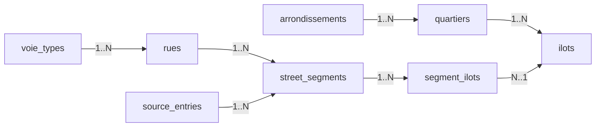

# Domain Data Model

This document describes the core domain model for address-based lookup in this project.
It focuses on entities, relationships, hierarchy, and the read pattern we optimize for.

The JSON batch an LLM emits from scans **before** application validation maps onto these tables via **`docs/LLM_EXTRACTION_INTERCHANGE.md`** and the persistence rules in **`docs/EXTRACTION.md`**.

**Source data (repo `data/`):**

| Path                                                             | Contents                                                                                                         |
| ---------------------------------------------------------------- | ---------------------------------------------------------------------------------------------------------------- |
| **`data/docs/SOURCE_BOBINE8_NDDC_TABLE_MODEL.md`**               | Printed layout and notation for bobine **8** (6ᵉ Notre-Dame-des-Champs).                                         |
| **`data/docs/SOURCE_BOBINE43_GRANDES_CARRIERES_TABLE_MODEL.md`** | Printed layout and notation for bobine **43** (18ᵉ Grandes Carrières).                                           |
| **`data/source-tables/`**                                        | Image-only PDF scans of the lookup registers.                                                                    |
| **`data/extracted-tables/`**                                     | Interchange JSON batches produced from those scans (e.g. `bobine8-extraction.json`, `bobine43-extraction.json`). |

## Goal And Optimization Target

Primary read pattern:

`(streetName, houseNumberWithOptionalSuffix) -> (arrondissement, quartier, ilot[])`

Key design choice:

- model source notations faithfully enough for auditability
- keep lookup fast with indexed range predicates
- keep provenance normalized and traceable

## Domain Hierarchy

Administrative hierarchy:

- `arrondissement` -> `quartier` -> `ilot`

Address mapping hierarchy:

- `rue` + `(parity, house-range)` -> `street_segment`
- `street_segment` -> one or more `ilot` via `segment_ilots`

Provenance hierarchy:

- one `source_entries` row represents one **logical register row** (street + îlot + numbers); printed cells are a guide — street usually fits the address cell, îlot may rarely spill, house numbers may **overflow downward** — still one provenance row with stitched `raw_text`
- one source entry can produce many `street_segments`

## Entity Relationship Graph



## Entities

## `arrondissements`

Role:

- top-level administrative partition

Core fields:

- `id`
- `number` (unique)
- `name`

## `quartiers`

Role:

- subdivision of an arrondissement

Core fields:

- `id`
- `arrondissement_id` (FK -> `arrondissements.id`)
- `name`
- `name_normalized`

Constraint:

- unique on `(arrondissement_id, name_normalized)`

## `ilots`

Role:

- globally-numbered historic block, attached to one quartier
- historical Paris administrative entity (later superseded by INSEE `IRIS` zones; out of scope here)

Core fields:

- `id`
- `quartier_id` (FK -> `quartiers.id`)
- `number` — globally unique across all 20 arrondissements of Paris, integer range `0..5000`

Constraint:

- unique on `number` (global across Paris dataset) — backed by an external domain fact, not a defensive choice

## `voie_types`

Role:

- reference table of the official French voie-type vocabulary (~220 values)
- seeded once from the canonical list; new values added by `INSERT`, not schema migration

Core fields:

- `id`
- `code` — canonical lowercase form (e.g. `rue`, `avenue`, `boulevard`, `petite rue`, `centre commercial`)

Constraint:

- unique on `code`

Display:

- the display-cased form (e.g. `Rue`, `Petite Rue`) is derived at the API serialization layer; the table stores only the lowercase canonical.
- **Capitalization rules** (single-word vs multi-word types, French typography vs title-case) are **TBD** pending a domain convention — see grill Q13.

## `rues`

Role:

- canonical voie entity, decomposed into `(type, libellé)`

Core fields:

- `id`
- `type_id` (FK -> `voie_types.id`)
- `libelle` — canonical libellé (e.g. `de Vaugirard`, `du Cherche-Midi`)
- `libelle_normalized` — match form of the libellé (see Normalized form below)

Constraints and indexes:

- unique on `(type_id, libelle_normalized)`
- non-unique index on `libelle_normalized` for libellé-only autocomplete

Display name:

- not stored; derived at the API serialization layer as `${voie_types.code, display-cased} ${libelle}`

See `docs/adr/0001-rue-as-type-libelle.md` for the rationale of the split and the FK reference table.

## `source_entries`

Role:

- one normalized provenance row for **one logical register row** (what the clerk wrote as a single horizontal notation)
- carries page-level metadata (quartier, bobine, page) as first-class columns

Core fields:

- `id`
- `quartier_id` (FK -> `quartiers.id`) — the quartier named in the bobine page header; **anchors the cross-quartier integrity rule** for all segments derived from this source entry
- `bobine` — reel number as an integer; other archival reference strings from the source are not stored in this column (audit-only outside the normalized row)
- `page`
- `raw_text` — stitched inscription for that **logical row** as emitted by extraction (street + îlot + numbers), including house numbers that **overflow downward**; see `docs/EXTRACTION.md` → Provenance Model
- `sequence` (optional ordering on a page)
- `notes` (optional provenance notes)

Why this table exists:

- avoids provenance duplication across many segments
- allows easy QA trace-back from lookup result to source notation
- gives the schema a place to anchor the page-level `quartier` so the cross-quartier rule can be enforced (see Triggers below)

## `street_segments`

Role:

- normalized address segment on a street side (`odd`/`even`) over an ordered range

Core fields:

- `id`
- `source_entry_id` (FK -> `source_entries.id`)
- `rue_id` (FK -> `rues.id`)
- `parity` (`odd` or `even`)
- `from_number`, `from_suffix_rank`
- `to_number`, `to_suffix_rank`
- `from_suffix`, `to_suffix` (display/source fidelity)
- `type_inferred` — SQLite integer boolean (`0`/`1`); `1` when the extractor inferred the voie type because the source had no explicit type token (see `docs/EXTRACTION.md` → Inferred-type rows)
- `quality_flags` — `INTEGER NOT NULL DEFAULT 0`; bitmask for QA (see `docs/EXTRACTION.md` → Segment quality flags)
- `notes` (segment-level note)

Range semantics:

- singletons are represented by equal endpoints
- order uses `(number, suffix_rank)` on each side

Constraint:

- `from < to OR (from = to AND from_suffix_rank <= to_suffix_rank)`

## `segment_ilots`

Role:

- junction table for many-to-many between segments and ilots

Core fields:

- `segment_id` (FK -> `street_segments.id`)
- `ilot_id` (FK -> `ilots.id`)

Constraint:

- composite primary key `(segment_id, ilot_id)`

Why this table exists:

- one source segment can legitimately map to 2-3 ilots
- avoids duplicating segment rows per ilot

## Triggers

### `segment_ilots_quartier_consistency`

`BEFORE INSERT ON segment_ilots` — rejects any pair whose `ilots.quartier_id` differs from the segment's `source_entries.quartier_id`. Enforces the "a multi-ilot source entry must remain within the same quartier" rule at the schema level.

```sql
CREATE TRIGGER segment_ilots_quartier_consistency
BEFORE INSERT ON segment_ilots
FOR EACH ROW
WHEN (
  (SELECT se.quartier_id
     FROM street_segments s
     JOIN source_entries se ON se.id = s.source_entry_id
    WHERE s.id = NEW.segment_id)
  !=
  (SELECT i.quartier_id FROM ilots i WHERE i.id = NEW.ilot_id)
)
BEGIN
  SELECT RAISE(ABORT, 'segment_ilots: ilot must share the source entry''s quartier');
END;
```

Drizzle Kit does not generate triggers from schema; this trigger lives in a hand-written migration file under `apps/api/drizzle/`.

## Normalized form

`libelle_normalized` and `quartiers.name_normalized` use the same Aggressive transform:

- lowercase
- strip accents (NFD, drop combining marks)
- replace `'` and `-` with space
- collapse whitespace

Examples:

- `de Vaugirard` → `de vaugirard`
- `du Cherche-Midi` → `du cherche midi`
- `d'Assas` → `d assas`
- `Notre-Dame-des-Champs` → `notre dame des champs`

Single source of truth: `apps/api/src/lib/normalize.ts`.

## Suffix Axis Model

Suffixes are modeled as ordered sub-positions on a house-number axis.

Canonical rank table (from `apps/api/src/lib/suffix.ts`):

- no suffix: `0`
- `bis`: `1`
- `ter`: `2`
- `quater`: `3`
- `quinquies`: `4`
- `sexies`: `5`
- `septies`: `6`

Tokens beyond `septies` are not modeled; the loader skips and logs them (same policy as other unsupported notations). See `docs/EXTRACTION.md`.

Example ordering:

`8 < 8bis < 8ter < 8quater < 8quinquies < 8sexies < 8septies < 10`

## Cardinalities (Summary)

- `arrondissements 1..N quartiers`
- `quartiers 1..N ilots`
- `rues 1..N street_segments`
- `source_entries 1..N street_segments`
- `street_segments N..N ilots` (through `segment_ilots`)

## Read Patterns

Disambiguation between rues that share a libellé is a **client-side** concern (autocomplete), so the lookup itself is strict on `rue_id`. See `docs/adr/0002-strict-lookup-api-with-rue-id.md`.

### Scope

- **v1** ships the **suggest** endpoint and the **number-bearing lookup**. The number is required on the v1 form; the form refuses submit otherwise.
- The **street-only lookup** (`rue_id` without a number) is **planned but deferred**. The data model already supports it; only the endpoint and its richer response shape (per-ilot segment ranges) are deferred. It will live on its own endpoint when it ships — not as a polymorphic `n?` overload of the v1 lookup — to keep each endpoint's response type single-shape.

## Suggest (autocomplete)

Input:

- libellé fragment (normalized client-side), **minimum length 2** characters

Matching (v1):

- **Prefix** on `rues.libelle_normalized` after normalization (index-friendly: `LIKE 'prefix%'`).
- **No** substring or fuzzy match in v1; revisit if real users need it.

Output:

- up to **20** rows, **`{ rue_id, type, libelle }`**, ordered **alphabetically** (by libellé, with a stable tie-break on `rue_id` if needed)

Index: `rues_libelle_normalized_idx (libelle_normalized)`.

## Primary lookup (optimized)

Input:

- `rue_id` (resolved by the suggest endpoint)
- number + optional suffix

Output:

- a list of `(arrondissement, quartier, ilot)` triples, **deduped** on `(arr, quartier, ilot)`
- a top-level `conflict: boolean` flag (see below)
- optional provenance details for QA when the client requests them via `?provenance=1`

Shape:

1. filter segments by `rue_id`, parity, and ordered range
2. join `segment_ilots` to resolve ilot(s)
3. join up hierarchy (`ilots` -> `quartiers` -> `arrondissements`)
4. dedupe by `(arr, quartier, ilot)` before returning to the client
5. compute `conflict` (see below)
6. optional join `source_entries` for traceability when `?provenance=1`

### `conflict` semantics

Multi-result is legitimate in one specific shape: a **single source entry** asserts the address belongs to multiple ilots via `segment_ilots` — the "shared edge / correction" case from the source documents (one row in `source_entries`, one row in `street_segments`, multiple rows in `segment_ilots`).

Any other multi-ilot result indicates that **distinct `source_entries` rows** disagree on the ilot for the same `(rue_id, n, parity)`. That's a data-quality signal, not a feature. The API surfaces it as `conflict: true` so the client (or a QA reviewer) can flag it.

Computation (cheap, no schema change): group the matching segments by `source_entry_id`. If the matched ilots span more than one source entry, set `conflict: true`.

## Why this is fast enough

- targeted index on street/range start:
  - `street_segments_rue_range_idx (rue_id, from_number, from_suffix_rank)`
- narrow join keys and integer FKs
- domain scale is modest relative to SQLite/D1 capabilities

## Canonical SQL (lookup + provenance)

```sql
SELECT a.number AS arr,
       q.name AS quartier,
       i.number AS ilot,
       se.bobine,
       se.page,
       se.sequence,
       se.raw_text
FROM street_segments s
JOIN source_entries se ON se.id = s.source_entry_id
JOIN segment_ilots si  ON si.segment_id = s.id
JOIN ilots i           ON i.id = si.ilot_id
JOIN quartiers q       ON q.id = i.quartier_id
JOIN arrondissements a ON a.id = q.arrondissement_id
WHERE s.rue_id = :rue_id
  AND s.parity = :parity
  AND (s.from_number, s.from_suffix_rank) <= (:n, :n_rank)
  AND (:n, :n_rank) <= (s.to_number, s.to_suffix_rank)
ORDER BY se.bobine, se.page, COALESCE(se.sequence, 0), i.number;
```

## Design Decisions And Rationale

- keep voie entity independent from quartier/arrondissement:
  - voies can span multiple administrative areas
- decompose voie name into `(type, libellé)`:
  - the source data carries this distinction; homonyms exist across types; libellé-only autocomplete is the primary search UX
  - see `docs/adr/0001-rue-as-type-libelle.md`
- keep source notation as canonical provenance:
  - `source_entries` represents what was written
- keep segments normalized and reusable:
  - one segment can map to multiple ilots without duplication
- avoid parity `both`:
  - parity inferred and stored as strict `odd|even`
- avoid open-ended ranges:
  - data contract assumes explicit endpoints only

## Relationship To `docs/EXTRACTION.md`

- `docs/DOMAIN_MODEL.md` explains the structural model and read optimization.
- `docs/EXTRACTION.md` defines how raw source notations are transformed into rows under that model.

Both should evolve together when schema rules change.
